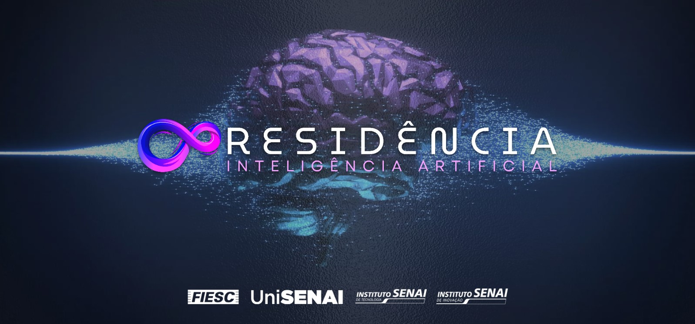

# Projeto de Manutenção Preditiva com IA

## Descrição do Problema

Este projeto tem como objetivo desenvolver um sistema inteligente de manutenção preditiva para máquinas industriais. A partir de dados coletados por dispositivos IoT, o sistema deve ser capaz de identificar a ocorrência de falhas e, se possível, o tipo específico da falha. O desafio principal é criar um modelo que preveja a classe do defeito e retorne a probabilidade associada, além de extrair insights operacionais e gerar visualizações de dados para a empresa.

O dataset fornecido (`bootcamp_train.csv`) contém informações de 8 atributos que descrevem o comportamento de desgaste da máquina e do ambiente, além de 5 possíveis classes de defeitos (FDF, FDC, FP, FTE, FA) e uma coluna indicando falha geral (`falha_maquina`).

## Estrutura do Repositório

- `notebook.ipynb`: Contém todo o desenvolvimento do projeto, desde a análise exploratória até a avaliação do modelo.
- `data/`: Pasta para armazenar os datasets.
  - `bootcamp_train.csv`: Dataset de treinamento e teste.
- `README.md`: Este arquivo, com a documentação do projeto.

## Como Executar o Projeto

Para replicar este projeto, siga os passos abaixo:

1.  **Clone o Repositório:**
    ```bash
    git clone <URL_DO_SEU_REPOSITORIO>
    cd <nome_do_repositorio>
    ```

2.  **Crie um Ambiente Virtual (Recomendado):**
    ```bash
    python -m venv venv
    source venv/bin/activate  # No Linux/macOS
    # venv\Scripts\activate  # No Windows
    ```

3.  **Instale as Dependências:**
    ```bash
    pip install pandas numpy matplotlib seaborn scikit-learn
    ```

4.  **Execute o Notebook Jupyter:**
    ```bash
    jupyter notebook notebook.ipynb
    ```
    Abra o arquivo `notebook.ipynb` no seu navegador e execute as células sequencialmente para reproduzir a análise e o treinamento do modelo.

## Metodologia e Etapas

O projeto foi desenvolvido seguindo as seguintes etapas:

### Etapa 1: Compreensão do Problema e Contextualização

Nesta fase inicial, foram importadas as bibliotecas essenciais e o dataset `bootcamp_train.csv` foi carregado. Uma análise preliminar foi realizada para entender a estrutura dos dados, tipos de variáveis, e identificar a presença de valores ausentes e inconsistências em colunas categóricas. O objetivo foi obter uma visão geral do dataset e do problema de negócio.

### Etapa 2: Análise Exploratória de Dados (EDA) e Pré-processamento

Esta etapa focou na limpeza e preparação dos dados:

-   **Tratamento de Inconsistências Categóricas:** Valores inconsistentes nas colunas de falha (e.g., 'Não', 'não', 'N', '0' para False; 'Sim', 'sim', '1' para True) foram padronizados para `True` ou `False`. O valor '-' na coluna `FDF (Falha Desgaste Ferramenta)` foi tratado como `False`.
-   **Tratamento de Dados Ausentes:** Valores nulos em colunas numéricas (`temperatura_ar`, `temperatura_processo`, `velocidade_rotacional`, `torque`, `desgaste_da_ferramenta`) foram preenchidos com a **mediana** de suas respectivas colunas, uma escolha robusta a outliers.
-   **Engenharia de Features:** A coluna categórica `tipo` (L/M/H) foi convertida usando **One-Hot Encoding**. Novas features como `temperatura_diferencial` e `potencia_estimada` foram criadas para capturar relações adicionais nos dados.
-   **Normalização/Escalonamento:** As features numéricas foram escalonadas usando `StandardScaler` para garantir que todas as variáveis contribuam igualmente para o modelo, transformando-as para ter média 0 e desvio padrão 1.

### Etapa 3: Definição do Problema de Modelagem e Métricas

Nesta etapa, o problema foi formalmente definido como uma **classificação multirrótulo**, onde uma única amostra pode apresentar múltiplos tipos de falha simultaneamente. As variáveis-alvo (`y`) foram definidas como as colunas de falha (`FDF`, `FDC`, `FP`, `FTE`, `FA`). As features (`X`) foram as demais colunas pré-processadas.

O dataset `bootcamp_train.csv` foi dividido em conjuntos de treino (80%) e teste (20%) usando `train_test_split`. Devido à natureza multirrótulo e à presença de combinações de rótulos muito raras, o parâmetro `stratify=y` foi **removido** para evitar erros, reconhecendo que o desbalanceamento de classes precisaria ser tratado em etapas posteriores.

As métricas de avaliação escolhidas foram **Precision, Recall, F1-Score e AUC-ROC**, consideradas mais adequadas para problemas com classes desbalanceadas do que a acurácia.

### Etapa 4: Modelagem e Treinamento

Um modelo `RandomForestClassifier` foi selecionado como classificador base, encapsulado por um `MultiOutputClassifier` para lidar com as múltiplas saídas (tipos de falha). O modelo foi treinado com os dados de treino (`X_train`, `y_train`) e, em seguida, utilizado para gerar previsões de classes (`y_pred`) e probabilidades (`y_pred_proba`) no conjunto de teste (`X_test`).

### Etapa 5: Avaliação do Modelo

O desempenho do modelo foi avaliado utilizando as métricas definidas. Foi gerado um relatório de classificação detalhado para cada rótulo, além dos scores AUC-ROC e médias agregadas (micro e macro). No entanto, foi observado que as métricas de Precision, Recall e F1-Score para as classes de falha estavam todas zeradas.

### Etapa 6: Visualização de Dados e Insights

Foram criadas visualizações para:

-   **Distribuição das Falhas:** Gráficos de contagem para cada tipo de falha, evidenciando o severo desbalanceamento de classes.
-   **Relação entre Features Numéricas e Falhas:** Box plots para explorar a distribuição das features em relação à ocorrência de falhas.
-   **Matriz de Correlação:** Heatmap para visualizar a correlação entre as features numéricas.
-   **Visualização do Relatório de Classificação:** Gráficos de barras para Precision, Recall e F1-Score por tipo de falha. Estes gráficos apareceram vazios devido às métricas zeradas, reforçando a necessidade de tratamento do desbalanceamento.

## Resultados e Conclusões

O modelo inicial, um `RandomForestClassifier` com `MultiOutputClassifier`, **não foi capaz de prever as ocorrências de falha (classe positiva)** no conjunto de teste. Isso foi evidenciado pelas métricas de Precision, Recall e F1-Score para as classes de falha estarem todas zeradas. O modelo, devido ao **severo desbalanceamento de classes** no dataset (onde a maioria das amostras representa a ausência de falha), otimizou-se para prever sempre a classe majoritária (sem falha).

Embora o modelo tenha sido treinado, sua incapacidade de identificar as falhas o torna inadequado para o propósito de manutenção preditiva, onde a detecção de falhas é crítica.

## Próximos Passos e Melhorias

Para tornar o modelo eficaz, os seguintes passos são cruciais:

1.  **Balanceamento de Classes:** A principal melhoria seria aplicar técnicas de balanceamento de classes. Uma abordagem recomendada é utilizar o hiperparâmetro `class_weight='balanced'` no `RandomForestClassifier`. Isso ajusta os pesos das classes durante o treinamento, penalizando mais o modelo por erros na classe minoritária (as falhas), forçando-o a prestar mais atenção a elas. Outras técnicas como oversampling (e.g., SMOTE) ou undersampling também poderiam ser exploradas.

2.  **Otimização de Hiperparâmetros:** Após o balanceamento, realizar uma otimização de hiperparâmetros (e.g., usando `GridSearchCV` ou `RandomizedSearchCV`) para encontrar a melhor combinação de parâmetros para o `RandomForestClassifier` que maximize as métricas de interesse (como F1-Score ou Recall para a classe positiva).

3.  **Exploração de Outros Modelos:** Testar outros algoritmos de classificação que são conhecidos por lidar bem com desbalanceamento de classes ou que são mais robustos, como `XGBoost`, `LightGBM` ou `CatBoost`, que possuem mecanismos internos para isso.

4.  **Análise de Erros:** Aprofundar a análise dos falsos negativos (falhas não detectadas) e falsos positivos (previsões de falha que não ocorreram) para entender melhor onde o modelo está falhando e guiar futuras melhorias.

Este projeto demonstra uma compreensão clara do problema e um roteiro bem definido para a construção de um modelo de manutenção preditiva eficaz, mesmo diante dos desafios impostos pelo desbalanceamento de dados.

---

## :handshake: **EQUIPE**

<b>Este projeto foi elaborado por:</b>

| Perfil                                                                                                            | Nome e Email                                   | Localização | Github                                                                                                                                                                           | Linkedin                                                                                                                                               |
| ----------------------------------------------------------------------------------------------------------------- | ---------------------------------------------- | ----------- | -------------------------------------------------------------------------------------------------------------------------------------------------------------------------------- | ------------------------------------------------------------------------------------------------------------------------------------------------------ |
|  | `Daniel Vidiri Neto`<br><br>dvn.face@gmail.com | Araras - SP | <a href="https://github.com/dvidirin"> </a> | [](https://www.linkedin.com/in/dvneto/) |

---

## Agradecimentos

- SENAI
- TODOS OS PROFESSORES DO SENAI


<p>
  
</p>
